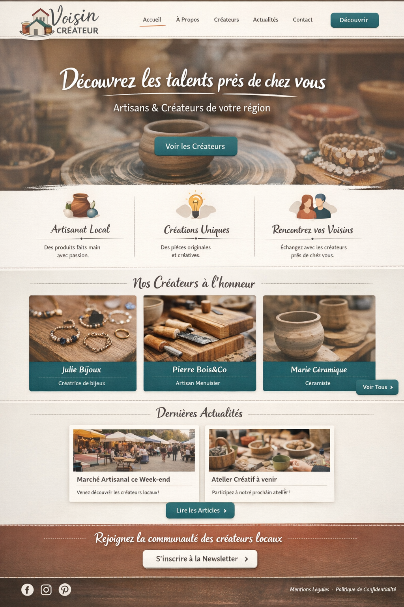

# 🏡 Voisin Créateur

**Voisin Créateur** est une plateforme sociale et commerciale de proximité qui permet aux artisans talentueux travaillant à domicile de vendre leurs créations uniques (pâtisseries, mode, accessoires, artisanat) directement aux habitants de leur quartier.

## 🎯 Vision du Projet
L'objectif est de recréer du lien social tout en soutenant l'économie locale. Voisin Créateur transforme chaque quartier en un marché vivant où le savoir-faire artisanal est à portée de clic.

## ✨ Fonctionnalités Clés

### 👨‍🎨 Pour les Artisans
- **Atelier Virtuel** : Gérer un catalogue de produits complet avec photos, descriptions et prix.
- **Gestion des Commandes** : Suivre l'état des commandes en temps réel.
- **Profil Personnalisé** : Partager son histoire et sa passion avec ses voisins.
- **Chat Intégré** : Communiquer directement avec les clients pour les détails de fabrication.

### 🛍️ Pour les Clients
- **Flux Inspirant** : Un "Instagram-like" pour découvrir les pépites créées juste à côté de chez soi.
- **Filtres Avancés** : Recherche par catégorie, prix ou localisation.
- **Notifications Temps Réel** : Être alerté dès qu'une commande est prête.
- **Achat Direct** : Commander en quelques clics sans intermédiaire complexe.

## 🛠️ Stack Technique
Le projet est bâti sur des technologies modernes pour garantir performance et réactivité :
- **Frontend** : [Next.js 15+](https://nextjs.org/) (App Router, Server Components)
- **Styling** : [Tailwind CSS 4](https://tailwindcss.com/)
- **Backend & Auth** : [Supabase](https://supabase.com/) (PostgreSQL, Realtime, Storage)
- **Hébergement** : [Vercel](https://vercel.com/)
- **Images** : [Cloudinary](https://cloudinary.com/) (Transformation et stockage optimisé)

## 📁 Structure du Projet
- `voisin-createur/` : Le code source de l'application Next.js.
- `agent_docs/` : Documentation interne sur l'architecture et les choix techniques.
- `AGENTS.md` : Le master plan et le suivi de l'avancement du projet.

## 🚀 Installation & Développement
Pour lancer le projet localement, consultez les instructions détaillées dans [le dossier app](./voisin-createur/README.md).

---
*Développé avec passion pour dynamiser nos quartiers.*
